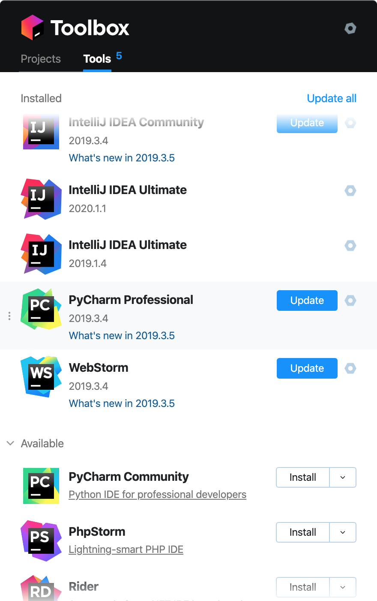

# 安卓-java

> jdk8肯定要安装的，然后分别是app的开发工具AndroidStudio，后台的开发工具Intelij IDEA，后台数据存储需要用到mysql，这里推荐mysql5.7或者mariadb。其他版本的mysql也许也能用，但是可能会有些意外的小问题。本文假设你是win 10 x64用户。

1. jdk1.8 [jdk-8u201下载](https://owncloud.coding-space.cn/soft/jdk-8u201-windows-x64.exe)
2. AndroidStudio [toolbox下载](https://owncloud.coding-space.cn/soft/jetbrains-toolbox-1.17.6856.exe)
3. Intelij IDEA [toolbox下载](https://owncloud.coding-space.cn/soft/jetbrains-toolbox-1.17.6856.exe)
4. mysql5.7或者mariadb [mariadb-10.1.10下载](https://owncloud.coding-space.cn/soft/mariadb-10.1.40-winx64.msi)
5. navicat [navicat珍藏破解下载](https://owncloud.coding-space.cn/soft/navicat_珍藏破解.rar)
6. git [git下载](https://owncloud.coding-space.cn/soft/Git-2.26.0-64-bit.exe)

> windows下软件的安装就不再多说，根据提示一步步安装就行了
# 各软件介绍
1. jdk1.8： 这个是开发app和后台的必备软件，不必多说。
2. toolbox： 管理idea家的各个软件，可以方便地安装android studio和idea。
3. android studio：开发app用的软件。
4. intelij idea: 开发java后台用到的软件
5. mysql(mariadb兼容mysql): 数据库软件，存储开发的系统的数据。
6. git: 目前最流行的分布式版本控制工具，方便地多人协作，增量更新同步代码。
7. navicat: mysql客户端，可视化管理mysql数据

# app与后台的关系

app安装在手机上之后，通过http协议与后台接口进行数据交互，后台收到app的请求之后，根据业务逻辑去查询或者修改数据库的数据，然后返回一些数据（我们通常使用json格式返回数据）给调用者。

###### 注意
开发的时候，安装app的手机必须与电脑的网络在同一个路由器下才可以访问，开发完成之后，可以选择把服务端部署在云服务器上，就可以实现24小时在任何地方都能够使用app。（服务器就是具有固定ip，24小时不间断运行，可以提供稳定的服务的电脑，我们可以去服务商[购买云服务器](../server/服务器购买.md)。）

上面如有解释不清楚的或者有其他疑问，可以发邮件到 roma@guanweiming.com 进行咨询

###### 附
