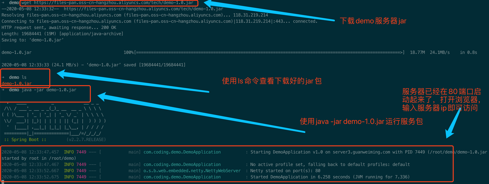
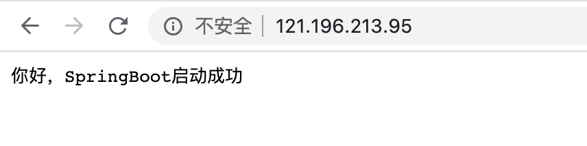

# ubuntu-Java

如果没有服务器，先去[买个阿里云学生服务器](服务器购买.md)

###### 连接服务器
> 打开bash的命令行界面然后输入 ssh username@serverip
根据提示输入密码就可以登录，把username和ip替换成你的服务器的用户名和ip

###### 安装java环境

```bash
# 更新系统
apt update
# 安装jdk8
apt install openjdk-8-jdk-headless
# 查看java版本
java -version

```
###### 测试下运行SpringBoot项目
```bash
# 下载我提供的服务器的包
wget https://files-pan.oss-cn-hangzhou.aliyuncs.com/tech/demo-1.0.jar
# java命令运行服务包
java -jar demo-1.0.jar
```
> 效果如下图所示


> 浏览器输入ip地址，可以看到如下界面
